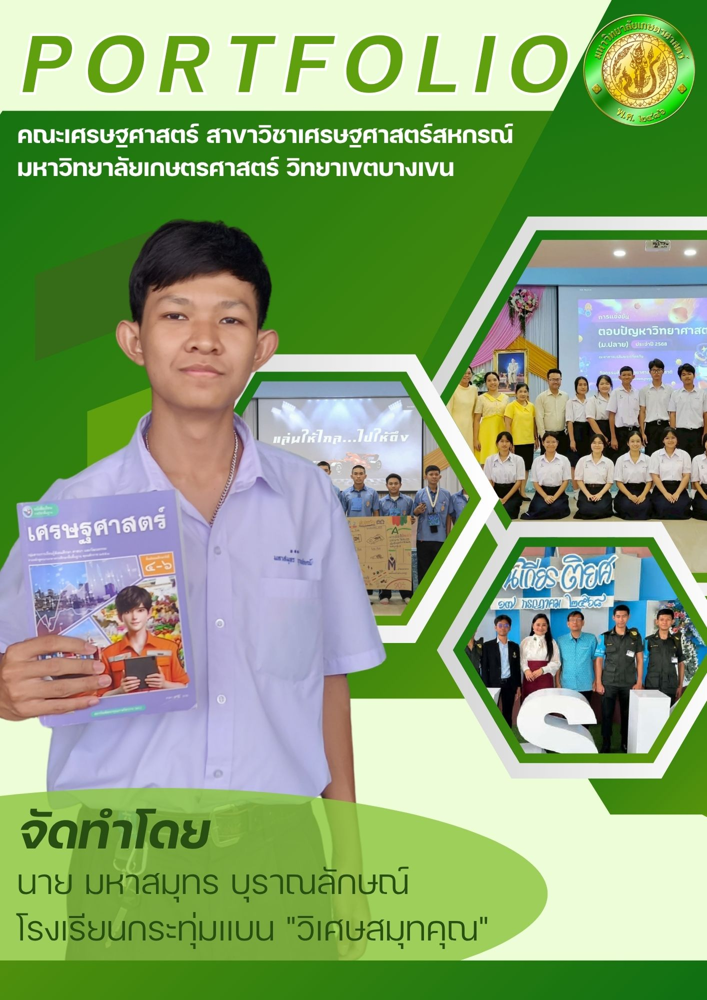
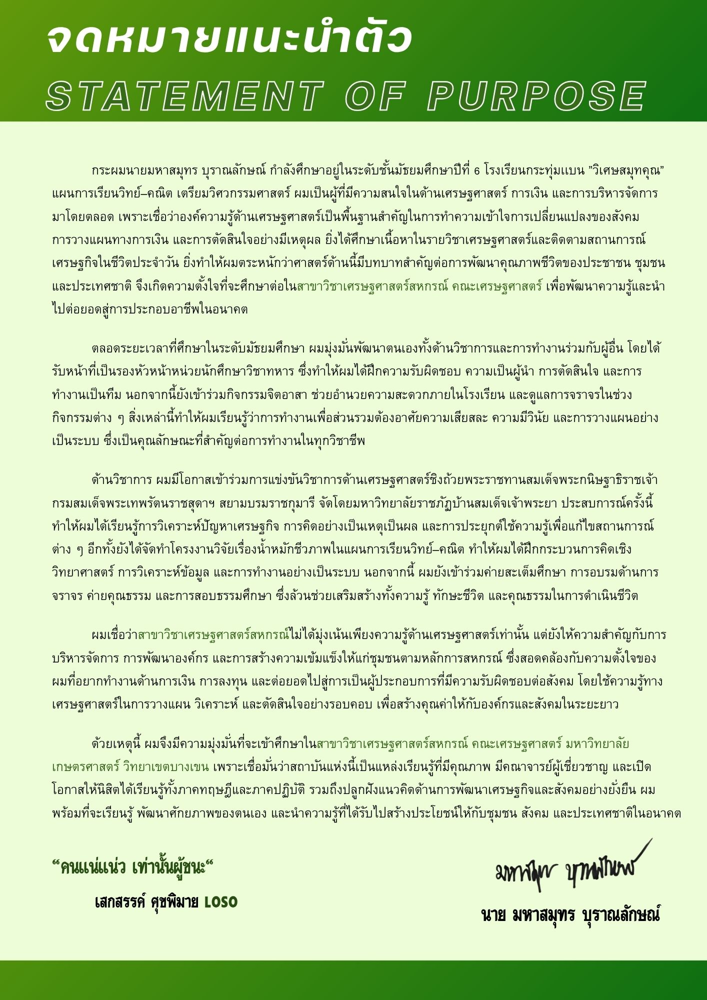
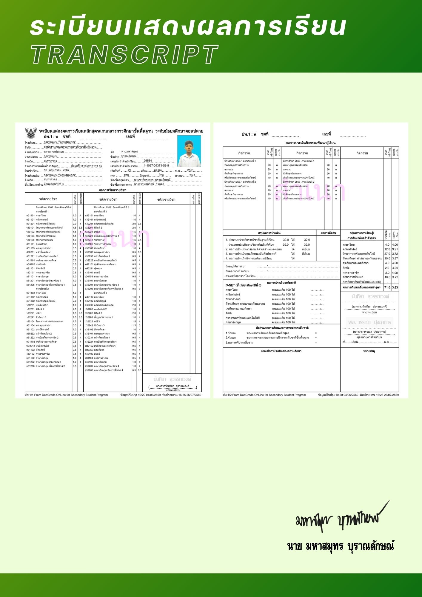
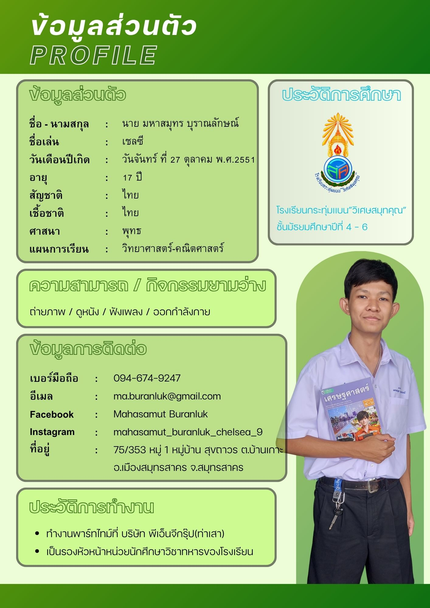
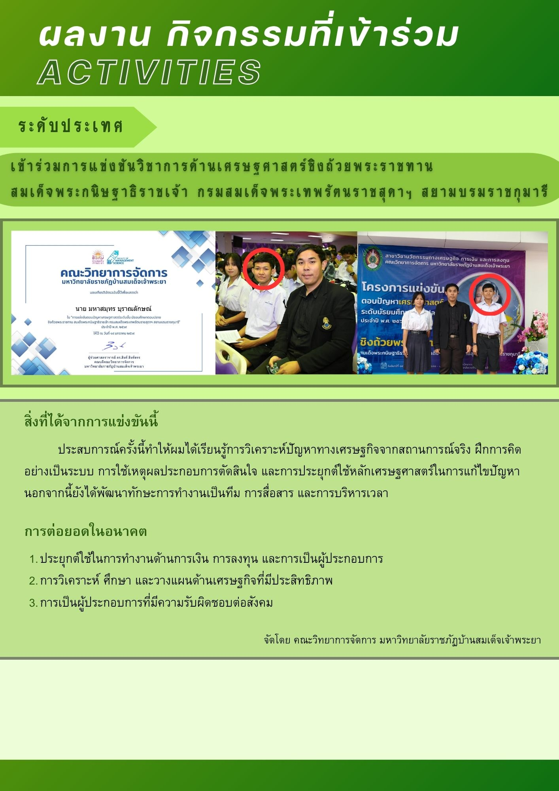
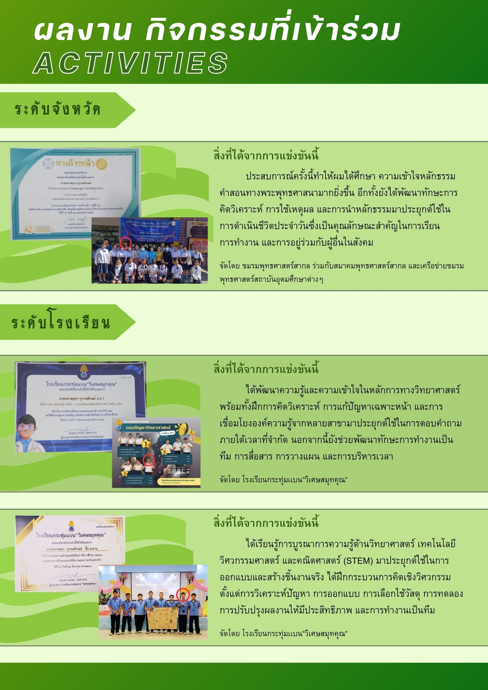
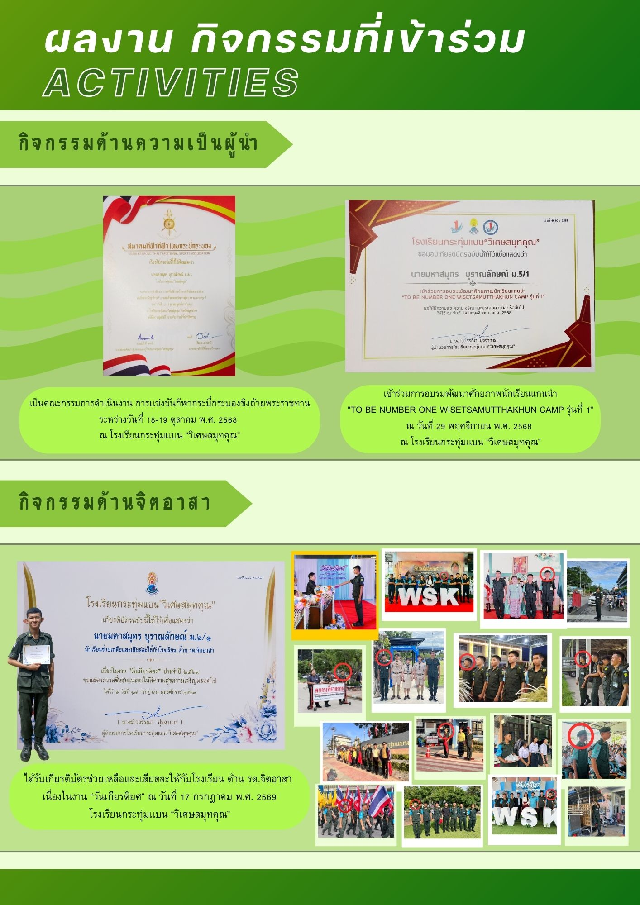
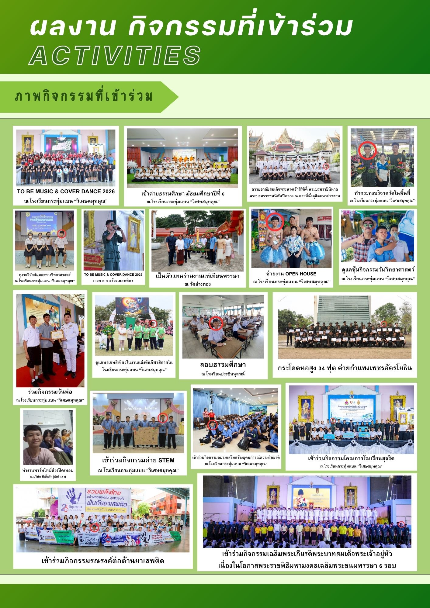
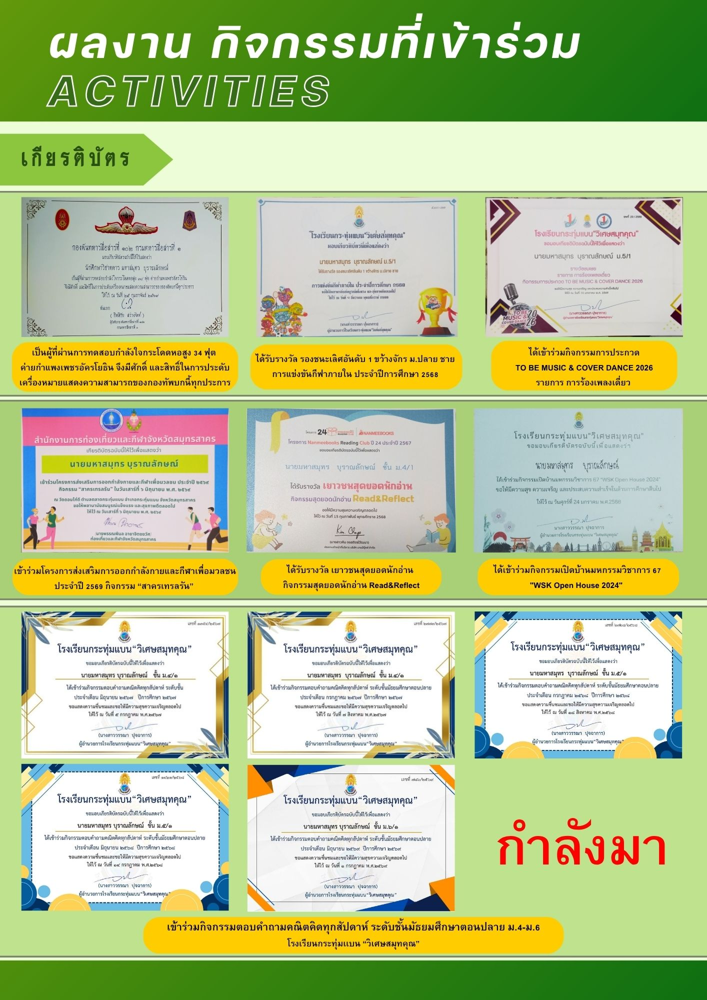
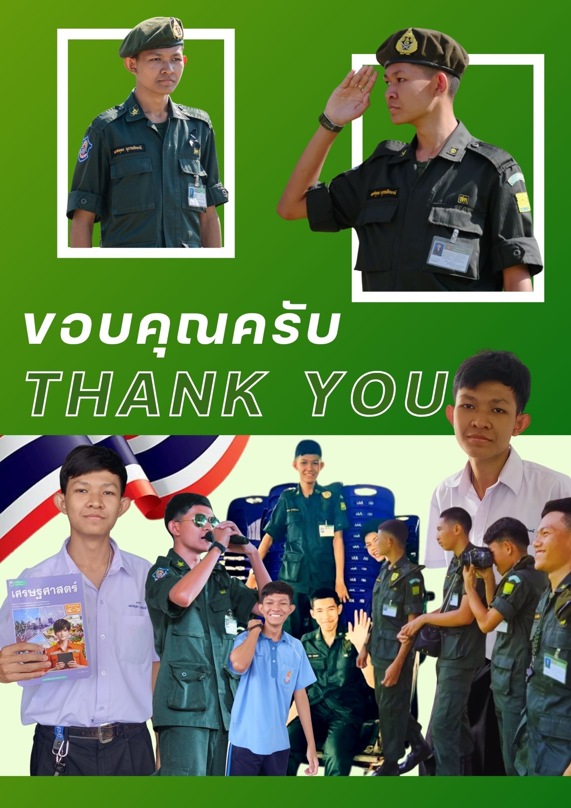

# 👋 Portfolio — Mahasamut Buranluk

## 🎓 About Me

สวัสดีครับ ผมนายมหาสมุทร บุราณลักษณ์
กำลังศึกษาอยู่ระดับชั้นมัธยมศึกษาปีที่ 6
โรงเรียนกระทุ่มแบน “วิเศษสมุทคุณ”

แผนการเรียนวิทย์–คณิต เตรียมวิศวกรรมศาสตร์

ผมมีความสนใจด้านเศรษฐศาสตร์ การเงิน และการบริหารจัดการ
และมีความตั้งใจที่จะศึกษาต่อใน
**คณะเศรษฐศาสตร์ สาขาวิชาเศรษฐศาสตร์สหกรณ์
มหาวิทยาลัยเกษตรศาสตร์ วิทยาเขตบางเขน**

---

## 📖 Statement of Purpose

ผมมีความสนใจในด้านเศรษฐศาสตร์ การเงิน และการบริหารจัดการ
เพราะเชื่อว่าองค์ความรู้ด้านเศรษฐศาสตร์เป็นพื้นฐานสำคัญ
ในการทำความเข้าใจการเปลี่ยนแปลงของสังคม
การวางแผนทางการเงิน และการตัดสินใจอย่างมีเหตุผล

ผมตั้งใจพัฒนาความรู้และประสบการณ์ของตนเอง
เพื่อนำไปต่อยอดสู่การประกอบอาชีพในอนาคต

---

## 🎓 Education

**โรงเรียนกระทุ่มแบน “วิเศษสมุทคุณ”**

- ระดับชั้นมัธยมศึกษาปีที่ 4–6
- แผนการเรียนวิทย์–คณิต เตรียมวิศวกรรมศาสตร์

---

## 🏆 Activities & Achievements

### 🥇 การแข่งขันวิชาการด้านเศรษฐศาสตร์

เข้าร่วมการแข่งขันวิชาการด้านเศรษฐศาสตร์
ชิงถ้วยพระราชทานสมเด็จพระกนิษฐาธิราชเจ้า
กรมสมเด็จพระเทพรัตนราชสุดาฯ สยามบรมราชกุมารี

**สิ่งที่ได้รับ**
- ฝึกการวิเคราะห์ปัญหาทางเศรษฐกิจ
- ฝึกการคิดอย่างเป็นระบบ
- ฝึกการใช้เหตุผลประกอบการตัดสินใจ
- เรียนรู้การทำงานเป็นทีม

### 🔬 STEM Camp

เข้าร่วมกิจกรรมค่าย STEM
ได้ฝึกการบูรณาการความรู้ด้านวิทยาศาสตร์
เทคโนโลยี วิศวกรรมศาสตร์ และคณิตศาสตร์

### ❤️ จิตอาสา

เข้าร่วมกิจกรรมจิตอาสา
ช่วยเหลือและอำนวยความสะดวกภายในโรงเรียน
รวมถึงกิจกรรม รด. จิตอาสา

---

## 📜 Certificates

รวบรวมเกียรติบัตรและรางวัลที่ได้รับจากกิจกรรมต่าง ๆ

- รางวัลจากการแข่งขันวิชาการ
- เกียรติบัตรกิจกรรมจิตอาสา
- เกียรติบัตรกิจกรรมด้านวิชาการ
- เกียรติบัตรกิจกรรมและการอบรมต่าง ๆ

---

## 💻 Skills & Interests

### Skills
- การคิดวิเคราะห์
- การทำงานเป็นทีม
- การสื่อสาร
- การวางแผนและบริหารเวลา
- การแก้ปัญหา

### Interests
- Economics
- Finance
- Investment
- Business
- Technology

---

## 📞 Contact

**Name:** Mahasamut Buranluk

**Email:** ma.buranluk@gmail.com

**Facebook:** Mahasamut Buranluk

**Instagram:** mahasamut_buranluk_chelsea_9

---

> Thank you for visiting my Portfolio! 🌱
>
> ---

# 📖 My Portfolio

## Portfolio Pages

### Page 1

### Page 2

### Page 3

### Page 4

### Page 5

### Page 6

### Page 7

### Page 8

### Page 9

### Page 10

